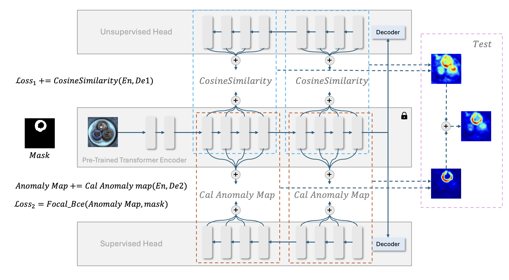
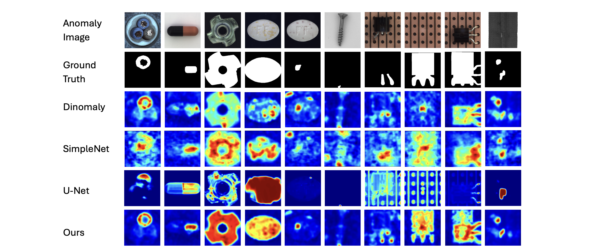
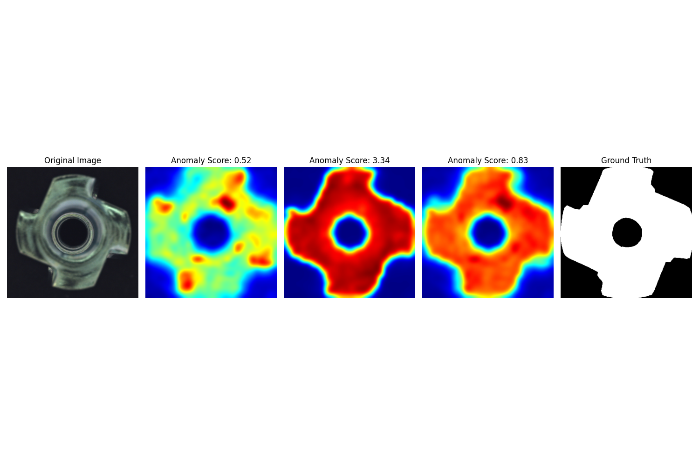

# Bi-Head-Dinomaly
비지도학습과 지도학습을 결합한 모델입니다. 모델은 정상이미지만으로도 좋은 탐지 결과가 나오지만, 일부 불량 이미지에 대해서 잘 탐지하지 못하는 경우 적은 라벨링의 지도학습으로 성능을 개선할 수 있는 모델입니다.


## Architecture


## Experiment



## Environments
```
conda create -n bi-head-dino python=3.8.20
conda activate bi-head-dino
pip install -r requirements.txt
```

## 📂 Dataset Directory Structure
```
class
├── train
│   ├── images
│   │     ├── good_1.png
│   │     ├── defect_1.png
│   │     └── ...
│   └── masks
│         ├── good_mask_1.png
│         ├── defect_mask_1.png
│         └── ...
└── test
    ├── images
    │     ├── good_1.png
    │     ├── defect_1.png
    │     └── ...
    └── masks
          ├── good_mask_1.png
          ├── defect_mask_1.png
          └── ...
```

good 이미지와 마스크는 반드시 이미지 이름에 good이 포함되어 있어야 합니다.

## Make a good mask
이 코드는 정상이미지의 마스크도 입력으로 받습니다.
make_good_mask.py를 실행하면 자동으로 good 이미지의 사이즈를 읽어 마스크를 생성합니다.
root directory와 mask directory를 자신의 경로에 맞게 수정하십시오.

`python make_good_mask.py

## Train
base dir과 class names, weight path를 당신의 디렉토리 위치에 맞게 수정하십시오
`python train_focal.py

## Test
base dir과 class names, weight path, 그리고 output dir를 당신의 디렉토리 위치에 맞게 수정하십시오
`python test_heatmap_with_mask.py


코드를 실행하면 위와 같은 테스트 결과가 output dir에 저장됩니다.
이는 MvtecDataset을 통해 모델의 출력과 정답 마스크의 차이를 한눈에 비교하기 위해 만들어진 코드입니다.

실제 이 모델을 사용해 이상탐지를 할 경우 테스트 데이터셋에는 mask가 필요 없을 수 있습니다.
mask 없이 모델의 출력만 시각화 하고 싶다면 다음 코드를 실행하십시오.
`python test_heatmap_only_image.py